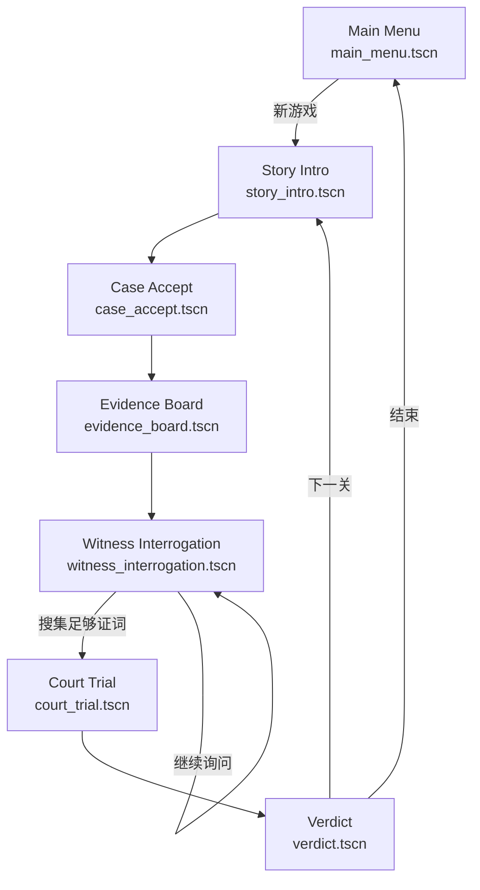
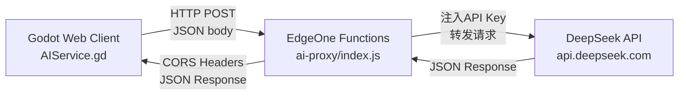

## 产品概述

逆转AI·法庭 — 一款AI驱动的法庭博弈AVG游戏，使用Godot 4.x引擎开发并导出为Web应用。玩家扮演新手律师，拥有专属AI助手系统，为被冤枉的人辩护。核心体验是在调查阶段审查证据、传唤证人进行AI对话搜集证词，在法庭阶段通过威慑、异议、出示证据揭穿谎言与伪造证据。

## 骨架阶段目标

本次搭建项目骨架并打通AI调用链路，包含：Godot项目初始化、7个游戏场景骨架与场景切换系统、EdgeOne Functions代理服务、端到端AI调用验证、案件数据结构定义。场景内部仅放基础布局节点和占位内容，具体UI细节和游戏逻辑后续逐步填充。

## 核心功能（骨架级）

- 开始界面（新游戏/继续/退出按钮）
- 剧情黑场过渡（打字机文字占位）
- 案件受理界面（文件解封占位）
- 连线整理界面（证据卡片+拖拽连线骨架）
- 传唤询问界面（左证人对话区+右AI助手面板布局）
- 法庭对决界面（左法庭区+右AI助手+底操作栏布局）
- 判决界面（胜诉/部分胜诉/败诉占位）
- SceneManager场景切换系统（fade过渡）
- AIService（HTTP请求EdgeOne代理，证人对话+助手分析两个模块）
- EdgeOne Functions代理（DeepSeek API转发+CORS处理）
- 案件数据结构（JSON schema + 关卡1模板）

## 技术栈

| 层 | 技术 | 说明 |
| --- | --- | --- |
| 引擎 | Godot 4.3（标准版，GDScript） | 免安装绿色版，下载zip解压即用；需额外下载Web导出模板 |
| 语言 | GDScript | Godot原生脚本，类Python语法 |
| AI调用 | DeepSeek API（OpenAI兼容格式） | 经EdgeOne Functions代理，密钥不进前端 |
| API代理 | EdgeOne Functions | 腾讯云Serverless函数，类似Cloudflare Workers |
| 部署 | EdgeOne Pages | Web导出后托管，浏览器可访问 |


## 实现方案

### 整体策略

采用Godot的Autoload单例模式管理全局状态，Scene树组织7个游戏流程场景。AI调用通过Godot的HTTPRequest节点异步请求EdgeOne Functions代理，代理转发至DeepSeek API并附加密钥，返回结果给Godot前端。骨架阶段所有场景仅包含布局节点和占位文本，AI链路用一个测试场景验证端通。

### 关键技术决策

**1. Autoload单例架构（3个全局管理器）**

- `SceneManager`：持有场景路径映射表，提供`change_scene(scene_name)`方法，通过CanvasLayer+ColorRect实现黑屏fade过渡。所有场景切换统一走此入口，避免散落的`get_tree().change_scene_to_file()`调用。
- `GameState`：全局游戏状态容器，持有当前关卡ID、证据库（Dictionary）、证词库（Array）、已揭穿矛盾列表、异议次数。场景间数据传递全部通过GameState，不依赖场景树节点引用。
- `AIService`：封装HTTPRequest节点，提供`chat_with_witness(npc_data, question)`和`analyze_evidence(testimony, evidence)`两个异步方法，通过信号`request_completed(result)`和`request_failed(error)`通知调用方。代理URL配置在常量中，开发期指向本地或EdgeOne测试地址。

**2. 场景切换设计**
使用CanvasLayer叠加ColorRect（纯黑alpha=0→1→0）实现fade过渡。流程：当前场景fade out → 切换场景 → 新场景fade in。过渡时间约0.5秒，避免突兀跳转。

**3. EdgeOne Functions代理设计**
单一代理函数处理两种AI请求，通过请求体的`module`字段区分：

- `module: "witness_chat"` → 构建DeepSeek system prompt（注入NPC Persona+知识边界+谎言设定+response_rules），转发玩家提问
- `module: "ai_assistant"` → 构建DeepSeek system prompt（注入证词库+证据库），请求矛盾分析+建议方向
代理函数负责：CORS预检响应、API密钥注入（从环境变量读取）、请求转发、错误处理、响应返回。

**4. AI防幻觉约束**
NPC的"知识"和"谎言"完全预设（JSON数据），AI只负责"怎么表达"（台词风格），不负责"事实内容"。DeepSeek的system prompt中明确约束：超出知识边界的问题统一回答"不知道/不记得"，谎言在未出示证据前坚持原说法。这确保AI没有编造事实的权限。

### 性能与可靠性

- HTTPRequest为异步非阻塞，AI调用期间显示加载指示器，不卡主线程
- AI响应建议设置超时（15秒），超时后提示"网络异常，请重试"
- EdgeOne代理应对DeepSeek API错误做try-catch，返回结构化错误信息（error_code + message）
- Godot Web导出的HTTPRequest受CORS限制，EdgeOne代理必须返回正确的`Access-Control-Allow-Origin`头

### 日志与调试

- 开发期使用Godot的`print()`输出AI请求/响应日志，便于调试
- EdgeOne代理使用`console.log`记录请求模块、耗时、状态码
- 上线前移除或降级详细日志，仅保留错误日志

### 影响范围控制

- 全新项目，无现有代码，无回归风险
- EdgeOne代理为独立函数，不影响其他服务
- 骨架阶段无游戏逻辑，场景间切换安全可逆
- API密钥仅存在EdgeOne环境变量，不进Git仓库

## 架构设计

### 场景流程



### AI调用链路



### 模块关系

- **Autoload层**：SceneManager / GameState / AIService — 全局单例，所有场景共享
- **场景层**：7个流程场景，各自持有对应的脚本控制器
- **UI组件层**：AIAssistantPanel / EvidenceCard / DialogueBox / TypewriterLabel — 可复用组件场景
- **系统层**：CaseManager / WitnessSystem / CourtSystem — 纯逻辑类（非Node），由场景脚本调用
- **数据层**：JSON案件文件 + CaseData类型定义
- **外部服务**：EdgeOne Functions代理 + DeepSeek API

## 目录结构

```
游戏项目1/
├── project.godot                              # [NEW] Godot项目配置文件。设置分辨率1920x1080、Web导出配置、Autoload注册、输入映射
├── export_presets.cfg                         # [NEW] 导出预设配置。Web(HTML5)导出设置，包含CORS扩展选项
│
├── scenes/
│   ├── main_menu.tscn                         # [NEW] 开始界面。3个按钮（新游戏/继续/退出），标题文字占位，深色背景
│   ├── story_intro.tscn                       # [NEW] 剧情黑场过渡。黑色背景+占位插画区+打字机文字区，点击推进
│   ├── case_accept.tscn                       # [NEW] 案件受理。文件解封动画占位+案件信息文字展示+进入调查按钮
│   ├── evidence_board.tscn                    # [NEW] 连线整理。证据卡片乱序排列区+连线绘制层+AI助手面板实例+完成按钮
│   ├── witness_interrogation.tscn             # [NEW] 传唤询问。HSplitContainer：左Panel（证人立绘占位+对话框+提问选项）、右Panel（AI助手面板实例）
│   ├── court_trial.tscn                       # [NEW] 法庭对决。HSplitContainer：左Panel（证人作证区+对方律师区+法官区+异议计数）、右Panel（AI助手面板实例）；底部Panel（威慑/异议/出示证据3按钮）
│   ├── verdict.tscn                           # [NEW] 判决界面。判决结果文字+统计信息（揭穿矛盾数）+继续/重试按钮
│   └── ui/
│       ├── ai_assistant_panel.tscn            # [NEW] AI助手面板（可复用）。疑点提示区+建议方向区+局势评估区，带滚动条
│       ├── evidence_card.tscn                 # [NEW] 证据卡片（可复用）。小图占位+证据名称+描述文字，支持拖拽
│       ├── dialogue_box.tscn                  # [NEW] 对话框（可复用）。RichTextLabel显示台词+提问选项按钮列表
│       └── typewriter_label.tscn              # [NEW] 打字机文字（可复用）。逐字显示文字，点击跳过到全文
│
├── scripts/
│   ├── autoload/
│   │   ├── SceneManager.gd                    # [NEW] 场景切换管理器。场景路径映射表、fade过渡（CanvasLayer+ColorRect+Tween）、change_scene方法
│   │   ├── GameState.gd                       # [NEW] 全局游戏状态。当前关卡ID、证据库、证词库、已揭穿矛盾列表、异议次数、案件数据引用
│   │   └── AIService.gd                       # [NEW] AI服务。HTTPRequest节点封装、代理URL常量、chat_with_witness方法、analyze_evidence方法、request_completed/failed信号、超时处理
│   ├── ui/
│   │   ├── AIAssistantPanel.gd                # [NEW] AI助手面板控制器。接收AI分析结果、更新疑点提示/建议方向/局势评估显示
│   │   ├── EvidenceCard.gd                    # [NEW] 证据卡片控制器。拖拽信号、点击选中信号、数据设置方法
│   │   ├── DialogueBox.gd                     # [NEW] 对话框控制器。设置台词、显示提问选项按钮、选项选中信号
│   │   └── TypewriterLabel.gd                 # [NEW] 打字机控制器。逐字显示Timer、点击跳过、显示完成信号
│   ├── systems/
│   │   ├── CaseManager.gd                     # [NEW] 案件管理（非Node纯类）。load_case(case_id)从JSON加载、get_evidence/witness/contradiction查询方法
│   │   ├── WitnessSystem.gd                   # [NEW] 证人系统（非Node纯类）。构建NPC Persona prompt、管理对话历史、知识边界检查
│   │   └── CourtSystem.gd                     # [NEW] 法庭系统（非Node纯类）。威慑/异议/出示证据逻辑、异议计数、胜负判定（关键矛盾数≥2胜诉）
│   ├── scenes/
│   │   ├── main_menu.gd                       # [NEW] 开始界面控制器。按钮点击→SceneManager切换场景
│   │   ├── story_intro.gd                     # [NEW] 剧情过渡控制器。打字机文字播放、点击推进、播放完毕→下一场景
│   │   ├── case_accept.gd                     # [NEW] 案件受理控制器。加载案件数据、显示案件信息、文件解封动画
│   │   ├── evidence_board.gd                  # [NEW] 连线整理控制器。证据卡片生成、拖拽连线判定、矛盾解锁
│   │   ├── witness_interrogation.gd           # [NEW] 传唤询问控制器。证人列表、提问选项管理、AIService调用、证词记录
│   │   ├── court_trial.gd                     # [NEW] 法庭对决控制器。证人作证流程、威慑/异议/出示证据操作、胜负判定
│   │   └── verdict.gd                         # [NEW] 判决界面控制器。显示判决结果、统计信息、继续/重试
│   └── data/
│       └── CaseData.gd                        # [NEW] 案件数据类型定义。Resource类，定义evidence/witnesses/contradictions/connections结构
│
├── data/
│   └── cases/
│       └── case_01.json                       # [NEW] 关卡1教学案数据模板。占位证据/证人/矛盾/连线数据，结构遵循敲定版第十二节JSON schema
│
├── assets/
│   ├── images/                                # [NEW] 图片资源目录。骨架阶段放置占位图（纯色方块）
│   ├── audio/                                 # [NEW] 音效目录。骨架阶段为空
│   └── fonts/                                 # [NEW] 字体目录。放置Noto Sans字体文件
│
├── edgeone/
│   └── functions/
│       └── ai-proxy/
│           └── index.js                       # [NEW] EdgeOne Functions代理。CORS处理、DeepSeek API转发、两模块路由（witness_chat/ai_assistant）、错误处理、环境变量读取API Key
│
├── 游戏设计文档_敲定版.md                      # [EXISTING] 设计文档（v0.4）
├── 游戏设计文档.md                             # [EXISTING] 旧版文档（参考）
├── 腾讯云黑客松比赛分析.md                      # [EXISTING] 比赛分析（参考）
└── 山海经卡牌肉鸽GDD.md                        # [EXISTING] 已废弃
```

## 实现备注

### Godot Web导出注意事项

- Godot 4.x Web导出需要在编辑器中下载Export Templates（Editor → Editor Data → Manage Export Templates → Download）
- 导出时需启用`CORS Support`和`CORS Headers`选项，否则HTTPRequest跨域请求会被浏览器拦截
- 导出的HTML文件需要通过HTTP服务器访问（不能直接file://打开），开发期可用`godot --serve`或Python http.server

### EdgeOne Functions注意事项

- EdgeOne Functions使用fetch handler模式（类似Cloudflare Workers），入口为`export default { async fetch(request, env) {} }`
- DeepSeek API密钥存储在EdgeOne环境变量中（如`DEEPSEEK_API_KEY`），通过`env.DEEPSEEK_API_KEY`读取
- 代理必须返回`Access-Control-Allow-Origin: *`和`Access-Control-Allow-Methods: POST, OPTIONS`头
- OPTIONS预检请求直接返回204空响应+CORS头

### DeepSeek API调用

- 端点：`https://api.deepseek.com/v1/chat/completions`（OpenAI兼容格式）
- 请求体：`{ model: "deepseek-chat", messages: [{role, content}], temperature: 0.7 }`
- 证人对话system prompt模板：注入NPC persona、knowledge_boundary（knows/does_not_know/lies_about）、response_rules，约束AI不超出知识边界
- AI助手system prompt模板：注入当前证词库+证据库，要求输出JSON格式`{ hints: [], suggestions: [], status: {} }`

### Godot项目配置要点

- project.godot中`display/window/size/viewport`设为1920x1080
- `display/window/size/stretch_mode`设为`canvas_items`，`stretch_aspect`设为`keep`，保证不同屏幕比例下UI不变形
- 注册3个Autoload：SceneManager、GameState、AIService
- 骨架阶段不需要配置输入映射（所有交互通过UI按钮点击）

## 设计风格

采用暗色极简风格，搭配Alan Becker风格火柴人美术，营造法庭的严肃感与火柴人的趣味性之间的张力。UI面板使用深色半透明背景+细边框，文字高对比度白色，关键交互元素用红/金强调色。整体视觉干净利落，不喧宾夺主，让玩家注意力集中在对话内容和证据推理上。

骨架阶段所有场景使用占位色块和文字，不放置实际美术资源。

### 布局原则

- 所有游戏场景统一1920x1080设计分辨率
- 调查界面和法庭界面采用左右分栏布局（左主内容区+右AI助手面板）
- 法庭界面底部固定操作栏（3个按钮：威慑/异议/出示证据）
- 场景切换使用0.5秒黑色fade过渡

## Agent Extensions

### Skill

- **context7-mcp**
- Purpose: 查询Godot 4.x GDScript API文档、EdgeOne Functions开发文档、DeepSeek API使用指南
- Expected outcome: 在实现AIService HTTPRequest调用、EdgeOne代理函数编写、DeepSeek prompt构建时，获取准确的API签名和用法示例，减少文档查找时间